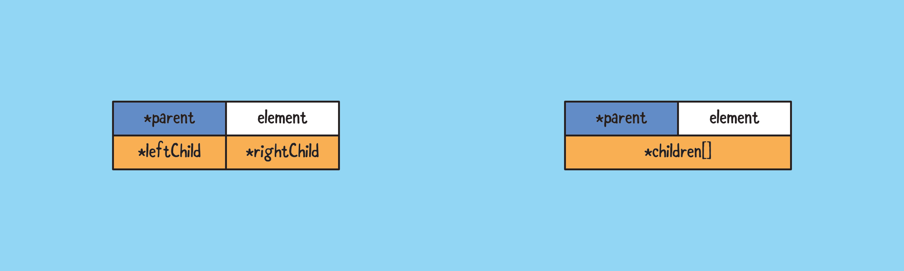

# Linked lists representation

The vector implementation of a binary tree discussed on the previous page is fast and simple, but it may be space inefficient when the tree height is large, since there will be alot of wasted space if the binary tree isn't proper.

We can used a **linked structure** as a natural way of representing a binary tree, where each node of *T* is represented by an object that references the element *v* itself and the positions associated with its parent and children.

The linked lists representation can be extended to general trees, by replacing the left and right child references with a list or vector, which is essentially a container to store its child references.

