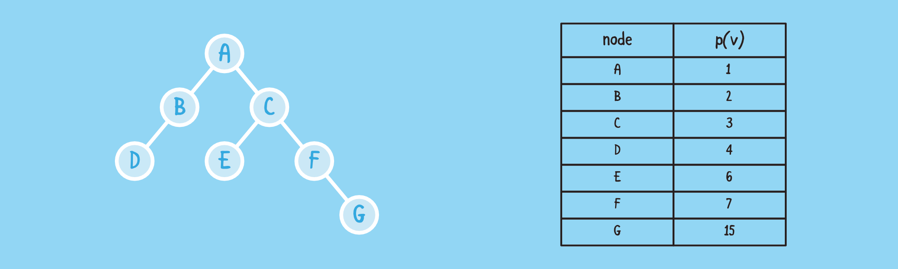

# Vector based representation

A vector-based structure for representing **binary** trees is based on a simple way of numbering the nodes of  T . We define a numbering function  p(.) , which is known as a **level numbering** of the nodes in a binary tree  T .


p(v) = \left\{
        \begin{array}{ll}
            1 & \quad \text{if} \, v \, \text{is the root} \\
            2p(u) & \quad \text{if} \, v \, \text{is the left child of the node} \, u \\
            2p(u) + 1 & \quad \text{if} \, v \, \text{is the right child of the node} \, u
        \end{array}
    \right.


## Running times
| Operation | Complexity |
| --------- | ---------- |
| `positions()`, `elements()` |  O(n)  |
| `swapElement(v, w)`, `replaceElements(v, e)` |  O(1)  |
| `root()`, `parent(v)`, `children(v)` |  O(1)  |
| `leftChild(v)`, `rightChild(v)`, `sibling(v)` |  O(1)  |
| `isInternal(v)`, `isExternal(v)`, `isRoot(v)` |  O(1)  |