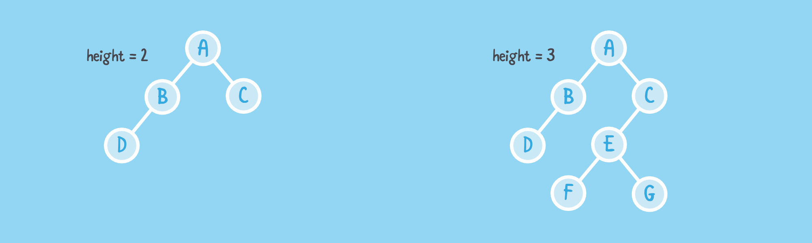

# Height and Depth

### Depth of a node
Let *v* be a node of a tree  T . The **depth** of  v  is the number of ancestors of  v , excluding  v  itself. The depth of the root is 0.

```
Algorithm depth(T, v)
  if T.isRoot(v) then
    return 0
  else
    return 1 + depth(T, T.parent(v))
```


### Height of a tree
The **height** of a tree is equal to the maximum depth of an external node of  T .

```
Algorithm height(T, v)
  if T.isExternal(v) then
    return 0
  else
    h = 0
    for each w in T.children(v) do
      h = max(h, height(T, w))
    return 1 + h
```

