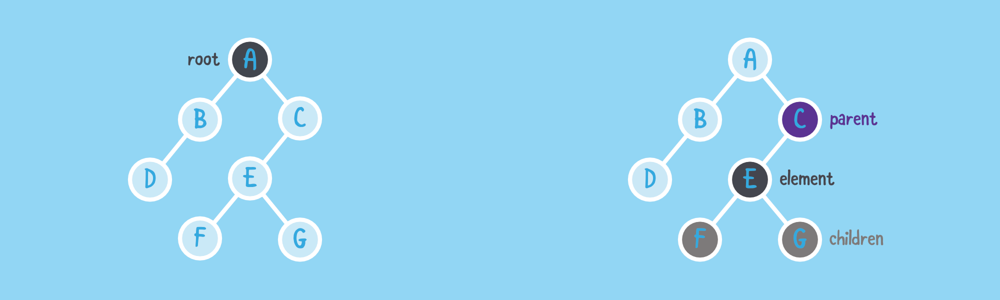

# Trees

A **tree** is an abstract data type for hierarchical storage of information. The top element of the tree is referred to as the **root** of the tree. Each **element** in a tree (except the root) has a **parent** and zero or more **child** elements.

A tree **T** is a non-empty set of nodes storing useful information in a parent-child relationship with the following properties:
- **T** has a special node *r* referred to as the **root**
- Each node *v* of **T** different from *r* has a parent node *u*
- If the node *u* is the **parent** (ancenstor) node of *v*, then *v* is a **child** (descendent) of *u*. Two children of the same parent are **siblings**
- A node is **external** (a leaf node) if it has no children and is **internal** if it one or more children

A **sub-tree** of T rooted at the node *v* is a tree consisting of all the descendants of *v* in *T*, including *v* itself.

A tree is **ordered** if a linear ordering relation is defined for the children of each node, that is, we can define an order among them.